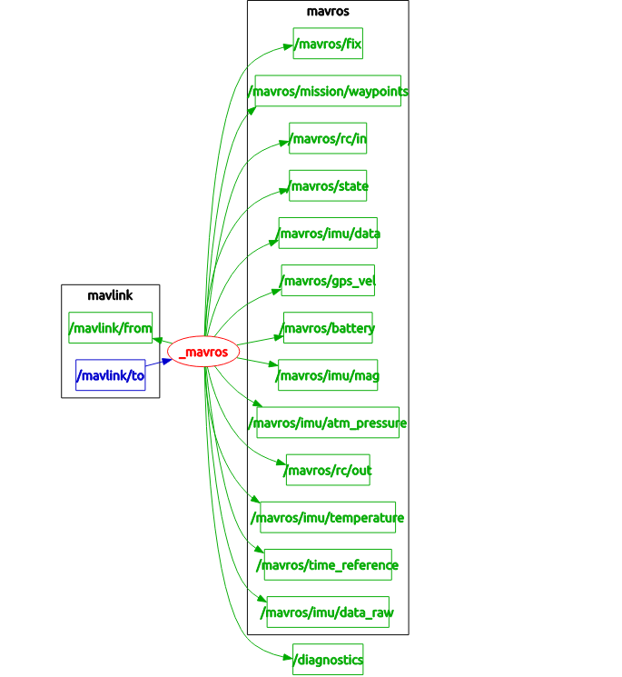

# `mavros` ROS package

l `mavros` is a MAVLink extendable communication node for ROS with UDP proxy for Ground Control Station. It's documented [here](http://wiki.ros.org/mavros).

This package (available [here](https://github.com/vooon/mavros)) implemments a MAVLink extendable communication node for ROS with UDP proxy for Ground Control Station that includes the following features:

- Communication with autopilot via serial port
- UDP proxy for Ground Control Station
- mavlink_ros compatible ROS topics (Mavlink.msg)
- Plugin system for ROS-MAVLink translation
- Parameter manipulation tool
- Waypoint manipulation tool


### Making mavlink as a library

Before compiling mavros, this is a necessary step that might take you some time if not done properly so we'll explain how to do it:

Go to your ROS *workspace* and clone the following package `https://github.com/vooon/mavros`.

-----

*Instead of manually clonning the repository, `wstool` can be used.*

-----

-----

*Note: A `.deb` has been generated for the BeagleBone and is available at https://github.com/vmayoral/ros-stuff/tree/master/deb*

-----

```
cd <catkin-ros-workspace>
cd src
git clone https://github.com/vooon/mavros
```

Now `checkout` the branch that corresponds with your ROS installation:
```
  master
  remotes/origin/HEAD -> origin/master
  remotes/origin/debian/hydro/mavlink
  remotes/origin/debian/hydro/precise/mavlink
  remotes/origin/debian/hydro/quantal/mavlink
  remotes/origin/debian/hydro/raring/mavlink
  remotes/origin/debian/indigo/mavlink
  remotes/origin/debian/indigo/saucy/mavlink
  remotes/origin/debian/indigo/trusty/mavlink
  remotes/origin/master
  remotes/origin/patches/debian/hydro/mavlink
  remotes/origin/patches/debian/hydro/precise/mavlink
  remotes/origin/patches/debian/hydro/quantal/mavlink
  remotes/origin/patches/debian/hydro/raring/mavlink
  remotes/origin/patches/debian/indigo/mavlink
  remotes/origin/patches/debian/indigo/saucy/mavlink
  remotes/origin/patches/debian/indigo/trusty/mavlink
  remotes/origin/patches/release/hydro/mavlink
  remotes/origin/patches/release/indigo/mavlink
  remotes/origin/release/hydro/mavlink
  remotes/origin/release/indigo/mavlink
  remotes/origin/upstream

```

Finally go to the `worspace` again and execute `catkin_make_isolated --install-space /opt/ros/hydro/ --install` (we recommend you to leave solely the mavlink package just cloned).

You should see something like this:
```
root:~/catkin_ws_hydro# catkin_make_isolated --install-space /opt/ros/hydro/ --install
Base path: /root/catkin_ws_hydro
Source space: /root/catkin_ws_hydro/src
Build space: /root/catkin_ws_hydro/build_isolated
Devel space: /root/catkin_ws_hydro/devel_isolated
Install space: /root/catkin_ws_hydro/install_isolated
~~~~~~~~~~~~~~~~~~~~~~~~~~~~~~~~~~~~~~~~~~~~~~~
~~  traversing 1 packages in topological order:
~~  - mavlink (plain cmake)
~~~~~~~~~~~~~~~~~~~~~~~~~~~~~~~~~~~~~~~~~~~~~~~
The packages or cmake arguments have changed, forcing cmake invocation

==> Processing plain cmake package: 'mavlink'
==> Creating build directory: 'build_isolated/mavlink/devel'
==> cmake /root/catkin_ws_hydro/src/mavlink-gbp-release -DCMAKE_INSTALL_PREFIX=/root/catkin_ws_hydro/devel_isolated/mavlink in '/root/catkin_ws_hydro/build_isolated/mavlink/devel'
-- Found PythonInterp: /usr/bin/python (found suitable version "2.7.3", required is "2")
-- processing: /root/catkin_ws_hydro/src/mavlink-gbp-release/message_definitions/v1.0/ardupilotmega.xml
-- processing: /root/catkin_ws_hydro/src/mavlink-gbp-release/message_definitions/v1.0/autoquad.xml
-- processing: /root/catkin_ws_hydro/src/mavlink-gbp-release/message_definitions/v1.0/common.xml
-- processing: /root/catkin_ws_hydro/src/mavlink-gbp-release/message_definitions/v1.0/matrixpilot.xml
-- processing: /root/catkin_ws_hydro/src/mavlink-gbp-release/message_definitions/v1.0/minimal.xml
-- processing: /root/catkin_ws_hydro/src/mavlink-gbp-release/message_definitions/v1.0/pixhawk.xml
-- processing: /root/catkin_ws_hydro/src/mavlink-gbp-release/message_definitions/v1.0/slugs.xml
-- processing: /root/catkin_ws_hydro/src/mavlink-gbp-release/message_definitions/v1.0/test.xml
-- processing: /root/catkin_ws_hydro/src/mavlink-gbp-release/message_definitions/v1.0/ualberta.xml
-- processing: /root/catkin_ws_hydro/src/mavlink-gbp-release/message_definitions/v1.0/sensesoar.xml
-- Using Debian Python package layout
-- Configuring done
-- Generating done
-- Build files have been written to: /root/catkin_ws_hydro/build_isolated/mavlink/devel
==> make -j1 -l1 in '/root/catkin_ws_hydro/build_isolated/mavlink/devel'
Scanning dependencies of target ardupilotmega.xml-v1.0
[ 10%] Generating ardupilotmega.xml-v1.0-stamp
Validating /root/catkin_ws_hydro/src/mavlink-gbp-release/message_definitions/v1.0/ardupilotmega.xml
Parsing /root/catkin_ws_hydro/src/mavlink-gbp-release/message_definitions/v1.0/ardupilotmega.xml
Note: message DATA64 is longer than 64 bytes long (74 bytes), which can cause fragmentation since many radio modems use 64 bytes as maximum air transfer unit.
Note: message DATA96 is longer than 64 bytes long (106 bytes), which can cause fragmentation since many radio modems use 64 bytes as maximum air transfer unit.
Validating /root/catkin_ws_hydro/src/mavlink-gbp-release/message_definitions/v1.0/common.xml
Parsing /root/catkin_ws_hydro/src/mavlink-gbp-release/message_definitions/v1.0/common.xml
...
```

`mavlink` package should be compiled and installed. Let's now compile `mavros`.

### Compiling `mavros`

Compilation is performed as described in the [mavlink_ros:compiling instructions](mavlink_ros.md). The package should be downloaded into `~/catkin_ws/src` and `catkin_make` should be called from `catkin_ws` (refer to [ROS: Building a ROS Package](../../ros/tutorials/building_a_ros_package.md) for learning more about ROS package compilation).

----

*WARNING: The `mavros` package is available for hydro+ distros. Take it into account.*

----


### Running `mavros`

So we start launching ardupilot:
``` bash
ArduCopter.elf -A tcp:*:6000:wait
```
We can easily verify that this launches a socket in all interfaces listening in port 6000:
``` bash
root:~# netstat -nap|grep Ardu
tcp        0      0 0.0.0.0:6000            0.0.0.0:*               LISTEN      24632/ArduCopter.elf
```

Finally we launch `mavros`:
```
root:~# rosrun mavros mavros_node _fcu_url:=192.168.7.2
[ INFO] [1404307547.212478943]: serial: device: /dev/ttyAutopilot @ 115200 bps
[ INFO] [1404307547.232303568]: udp: Bind address: 0.0.0.0:14555
[ INFO] [1404307547.246258485]: udp: GCS address: 127.0.0.1:14550
[ INFO] [1404307548.616922693]: Plugin Command [alias command] loaded and initialized
[ INFO] [1404307548.745958777]: Plugin GPS [alias gps] loaded and initialized
[ INFO] [1404307548.965828360]: Plugin IMUPub [alias imu_pub] loaded and initialized
[ INFO] [1404307549.109628860]: Plugin Param [alias param] loaded and initialized
[ INFO] [1404307549.200207318]: Plugin RCIO [alias rc_io] loaded and initialized
[ INFO] [1404307549.357753943]: Plugin SystemStatus [alias sys_status] loaded and initialized
[ INFO] [1404307549.588623860]: Plugin Waypoint [alias waypoint] loaded and initialized
[ INFO] [1404307549.597910485]: MAVROS started on MAV 1 (component 240)

```

#### Playing with `mavros`



```bash
victor@ubuntu:~$ rosnode list
/mavros
/rosout
victor@ubuntu:~$ rostopic list
/diagnostics
/mavlink/from
/mavlink/to
/mavros/battery
/mavros/fix
/mavros/gps_vel
/mavros/imu/atm_pressure
/mavros/imu/data
/mavros/imu/data_raw
/mavros/imu/mag
/mavros/imu/temperature
/mavros/mission/waypoints
/mavros/rc/in
/mavros/rc/out
/mavros/state
/mavros/time_reference
/rosout
/rosout_agg

```

You need to set the stream rate:

```bash
rservice call /mavros/set_stream_rate 0 10 1
```

Then you can visualize topics
```bash
 rostopic list
/diagnostics
/mavlink/from
/mavlink/to
/mavros/battery
/mavros/camera_image
/mavros/camera_image/compressed
/mavros/camera_image/compressed/parameter_descriptions
/mavros/camera_image/compressed/parameter_updates
/mavros/camera_image/compressedDepth
/mavros/camera_image/compressedDepth/parameter_descriptions
/mavros/camera_image/compressedDepth/parameter_updates
/mavros/camera_image/theora
/mavros/camera_image/theora/parameter_descriptions
/mavros/camera_image/theora/parameter_updates
/mavros/fix
/mavros/global_position/compass_hdg
/mavros/global_position/global
/mavros/global_position/gps_vel
/mavros/global_position/local
/mavros/global_position/rel_alt
/mavros/gps_vel
/mavros/imu/atm_pressure
/mavros/imu/data
/mavros/imu/data_raw
/mavros/imu/mag
/mavros/imu/temperature
/mavros/mission/waypoints
/mavros/mocap/pose
/mavros/optical_flow
/mavros/position/local
/mavros/position/vision
/mavros/radio_status
/mavros/rc/in
/mavros/rc/out
/mavros/rc/override
/mavros/safety_area/set
/mavros/setpoint/accel
/mavros/setpoint/att_throttle
/mavros/setpoint/cmd_vel
/mavros/setpoint/local_position
/mavros/state
/mavros/time_reference
/mavros/vfr_hud
/mavros/vision_speed/speed_vector
/rosout
/rosout_agg
/tf
```

For example, IMU:

```bash
rostopic echo /mavros/imu/data_raw
---
header:
  seq: 11149
  stamp:
    secs: 1412071746
    nsecs: 586876282
  frame_id: fcu
orientation:
  x: 0.0
  y: 0.0
  z: 0.0
  w: 0.0
orientation_covariance: [-1.0, 0.0, 0.0, 0.0, 0.0, 0.0, 0.0, 0.0, 0.0]
angular_velocity:
  x: 0.006
  y: -0.005
  z: 0.009
angular_velocity_covariance: [1.2184696791468346e-07, 0.0, 0.0, 0.0, 1.2184696791468346e-07, 0.0, 0.0, 0.0, 1.2184696791468346e-07]
linear_acceleration:
  x: -0.24516625
  y: 0.0196133
  z: 10.52253545
linear_acceleration_covariance: [8.999999999999999e-08, 0.0, 0.0, 0.0, 8.999999999999999e-08, 0.0, 0.0, 0.0, 8.999999999999999e-08]
---
```

-----

Some aspects has change. Refer to the package docs for an updated documentation.

------

